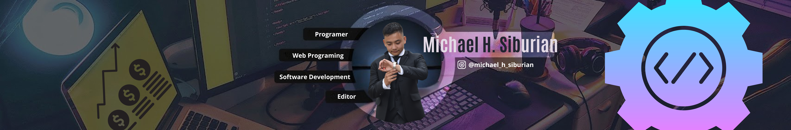

## Hello World I'm [Michael Siburian](https://www.instagram.com/michael_h_siburian?igsh=MTFmdjh4NGx5MTFwOQ==) 👋

<!-- # 💫 About Me:
Hello World I'm Michael Siburian 👋 -->

##### 🌐 Socials:
  

##### 💻 Tech Stack:
                 
##### 📊 GitHub Stats:
 
 

##### 🏆 GitHub Trophies

---

<!-- Proudly created with GPRM ( https://gprm.itsvg.in ) -->

<!-- - 🌱 I learned programming from [**Sandhika Galih**](UCkXmLjEr95LVtGuIm3l2dPg) and i learned investment📈 from [**Timothy Ronald**](UCXMB8OiiSnq2B4xLgUtTYhw) and [**kalimasada**](UCe9_rJjMmQS5C_LobUZ_pHg).

 -->